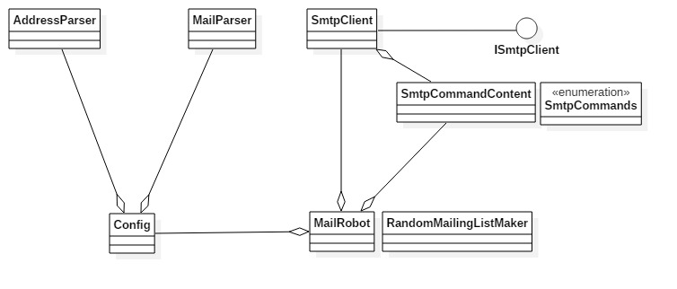
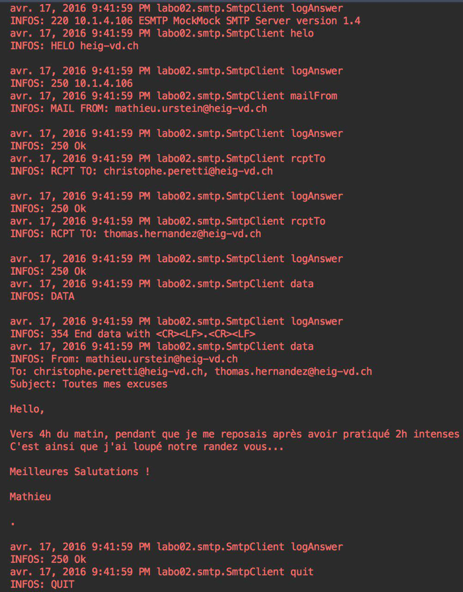
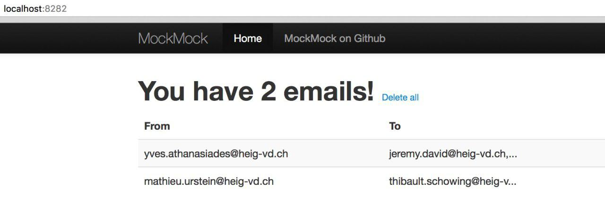

# SMTP Lab Report #

**Authors**: Michaël Rohrer and Lucie Steiner

##Our project##
Out tool provides a simple way to run prank campaigns. You just have to edit some files in order to specify the victims of your prank and the e-mails that they are going to receive. Our tool will then forge e-mails and send them to your victims, with the e-mail address of one of your victims as sender.

Based on the configuration you'll set and on your mailing list, our tool will randomly generate groups of victims and then choose for each group one of your e-mails. It will be sent to all the victims of that group, except the one victim that will be randomly defined as the sender. 

If you first want to test our tool before sending real e-mails to your victims, you can use a mock SMTP server (check the instructions below in the "Installing and using a mock SMTP server" section).

##Configuration##
In order to use our tool, you have to edit the following files:

- **config.txt**

	The config.txt file contains the following fields: 
	
	    port = 25  
	    domain = heig-vd.ch
	    smtpServer = mailcl0.heig-vd.ch
	    nbGroup = 2
	    grpSize = 3
		 mailList = textSrc/mails.txt
		 mailingList = textSrc/mailing_list.txt
	
	*port*: number of the port you want to connect to in order to reach the smtp server.
	
	*domain*: any domain name you like. It doesn't have to be a real domain name.
	
	*smtpServer*: name of the smtp server you want to send e-mails to.
	
	*nbGroup*: number of the groups of victims that should be formed.
	
	*grpSize*: Number of victims in a group.
	
	*mailList*: Name of the file containing the texts for the e-mails you want to send. You can either edit the mails.txt file  (see below) or create a new one. This file has to be in the textSrc directory.

	*mailingList*: Name of the file containing the e-mails adresses of your victims. You can either edit the mailing_list.txt file (see below) or create a new one. This file also has to be in the textSrc directory.

- **mailing_list.txt**

	This file contains a list of e-mail adresses. You just have to erase the content of this file and copy the e-mail adresses of the victims in it. 

	There are only two restrictions: 
	- Each line only contains one e-mail adress.
	- An e-mail adress can only appear once in the file.
	 

- **mails.txt**
	This file contains the texts of the e-mails you will send to your victims. You can erase the content and write new texts. Your texts should have this format:

		<<
		Subject: write the subject of your mail here
		Write your text here
		>>

##Implementation##

The class diagram below shows the structure of our application:

Here is a brief description of the most important classes:

- *Config:* This class is used to parse the file containing the configuration, it is also used as a container for the configuration options, the list of e-mails that could be sent and the mailing list.
- *SmtpClient:* This class is used to send e-mails. It implements the smtp commands used to send smtp requests to an smtp server.
- *SmtpCommandContent: *This class contains all the argument that will be used with the different smtp commands sent to the server. It also formats the different arguments to fit the smtp commands
- *MailRobot:* This class is the main class, it is used to send the prank e-mails to the different groups randomly selected according to the config file.

Here is the dialog between MailRobot and the SMTP server, using SmtpClient:

##Installing and using a mock SMTP server##
As already mentioned, a mock SMTP server can be used with our tool if you first want to check the e-mails you are sending. You will be connected to the mock SMTP server instead of a real one, so your victims won't receive the e-mails. Every e-mail our tool sends will instead reach the mock server. This enables you to consult them and check if everything is fine before starting your real prank campaign. 

Here are the steps to install and use MockMock, a mock SMTP server:

**Installing MockMock**

1. Just go on the following link: [https://github.com/tweakers-dev/MockMock](https://github.com/tweakers-dev/MockMock)
2.  Download the MockMock.jar file
3.  Unzip it in the directory of your choice

**Using MockMock**

1. Go to the directory where you have unzipped the .jar file.
2. Run the following command: `java -jar MockMock-1.4.0.one-jar.jar`. This command starts the SMTP server on port 25 and the webserver on port 8282. If you want to change the SMTP server port, add `-p <port>` to your command. 
3. In the config.txt file of our tool, change the port to 8000 and the smtpServer to localhost.
4. Run our tool, then use your browser to reach the localhost on port 8282. You should see something like this:

